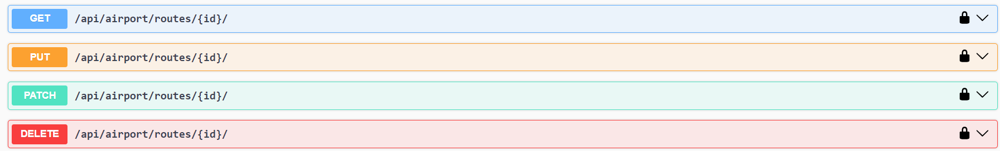

# Airline Management System

An airline management system built using Django REST Framework, Docker, and PostgreSQL.

## Table of Contents

- [Introduction](#introduction)
- [Features](#features)
- [Prerequisites](#prerequisites)
- [Getting Started](#getting-started)
  - [Docker Setup](#installation)
  - [Environment Variables](#environment-variables)
- [Database schema](#database-schema)
- [Endpoints](#endpoints)
  - [Main page](#main_page)
  - [Airplanes api](#airplanes_api)
    - [Airplanes list](#airplanes_list)
    - [Airplanes detail](#airplanes_detail)
  -  [Airplane type api](#airplane_type_api)
    - [Airplane type list](#airplane_type_list)
    - [Airplane type detail](#airplane_type_detail)
  -  [Airport api](#airports_api)
    - [Airport list](#airports_list)
    - [Airport detail](#airports_detail)
  - [Crew api](#crew_api)
    - [Crew list](#crew_list)
    - [Crew detail](#crew_detail)
  - [Flights api](#flights_api)
    - [Flights list](#flights_list)
    - [Flights detail](#flights_detail)
  - [Orders api](#orders_api)
    - [Orders list](#orders_list)
    - [Orders detail](#orders_detail)
  - [Routes api](#routes_api)
    - [Routes list](#routes_list)
    - [Routes detail](#routes_detail)
  - [Users api](#users_api)


## Introduction

The Airline Management System is a Django-based application designed to manage various aspects of an airline, including crew members, countries, airports, airplanes, routes, orders, and flights.

## Features

### Django REST Framework Viewsets

#### 1. CrewViewSet

- **Endpoint:** `/api/airport/crew/`
- **Actions:**
  - `list`: List all crews.
  - `retrieve`: Retrieve a specific crew.
- **Additional Actions:**
  - `list`: Returns a detailed list of crews.


#### 2. UserViewSet

- **Endpoint:** `/api/user/me`
- **Actions:**
  - `retrieve`: Retrieve your information.

#### 3. AirportViewSet

- **Endpoint:** `/api/airport/airports`
- **Actions:**
  - `list`: List all airports.
  - `retrieve`: Retrieve a specific airport.
- **Additional Actions:**
  - `list`: Returns a list of airports.

#### 4. AirplaneTypeViewSet

- **Endpoint:** `/api/airport/airplane-type/`
- **Actions:**
  - `list`: List all airplane types.
  - `retrieve`: Retrieve a specific airplane type.

#### 5. AirplaneViewSet

- **Endpoint:** `/api/airport/airplanes/`
- **Actions:**
  - `list`: List all airplanes.
  - `retrieve`: Retrieve a specific airplane.
  - `upload_image`: Upload an image for a specific airplane (Admin only).
- **Additional Actions:**
  - `upload_image`: Allows administrators to upload an image for a specific airplane.

#### 6. RouteViewSet

- **Endpoint:** `/api/airport/routes/`
- **Actions:**
  - `list`: List all routes.
  - `retrieve`: Retrieve a specific route.
- **Additional Features:**
  - **Filtering:** Supports filtering routes by source and destination cities.

#### 7. OrderViewSet

- **Endpoint:** `/api/airport/order/`
- **Actions:**
  - `list`: List all orders for the authenticated user.
  - `retrieve`: Retrieve a specific order for the authenticated user.
  - `create`: Create a new order for the authenticated user.
- **Additional Features:**
  - **Pagination:** Orders are paginated with a page size of 5.

#### 8. FlightViewSet

- **Endpoint:** `/api/airport/flights/`
- **Actions:**
  - `list`: List all flights with details about available seats.
  - `retrieve`: Retrieve a specific flight.
- **Additional Features:**
  - **Seats Availability:** Provides information about available seats for each flight.

## Prerequisites

Ensure you have the following installed on your system:

- [Docker](https://docs.docker.com/get-docker/)
- [Docker Compose](https://docs.docker.com/compose/install/)
- [Git](https://git-scm.com/)

## Getting Started

## Installation

This project is built using [Docker](https://www.docker.com/) and requires certain dependencies to be installed. Follow the instructions below based on your operating system.

### Windows

1. **Clone the Repository:**
    ```bash
    git clone https://github.com/MatsalakO/airport-api-service
    cd airport-api-service
    git checkout develop
    ```

2. **Create a Virtual Environment:**
    ```bash
    python -m venv venv
    ```

3. **Activate the Virtual Environment:**
    ```bash
    venv\Scripts\activate
    ```

4. **Set Environmental Variables:**
    - Create a `.env` file in the project root directory.
    - Use the provided `.env.sample` as a template to fill in your data.

5. **Build Docker Containers:**
    ```bash
    docker-compose build
    ```

6. **Start Docker Containers:**
    ```bash
    docker-compose up
    ```

### macOS and Linux

1. **Clone the Repository:**
    ```bash
    git clone https://github.com/MatsalakO/airport-api-service
    cd airport-api-service
    git checkout develop
    ```

2. **Create a Virtual Environment:**
    ```bash
    python -m venv venv
    ```

3. **Activate the Virtual Environment:**
    ```bash
    source venv/bin/activate
    ```

4. **Set Environmental Variables:**
    - Create a `.env` file in the project root directory.
    - Use the provided `.env.sample` as a template to fill in your data.

5. **Build Docker Containers:**
    ```bash
    docker-compose build
    ```

6. **Start Docker Containers:**
    ```bash
    docker-compose up
    ```

Now, the Airport API Service should be up and running on your local machine. Access the documentation and interact with the API through your web browser.

Remember to adjust any file paths or commands based on your specific system configurations.


# Airline Management System

An airline management system built using Django REST Framework, Docker, and PostgreSQL.

## Environment Variables


Ensure the following environment variables are set in your `.env` file:

```env
# Django settings
DJANGO_SECRET_KEY=your_secret_key

# PostgreSQL settings
POSTGRES_HOST=postgres
POSTGRES_NAME=postgres
POSTGRES_USER=postgres
POSTGRES_PASSWORD=postgres
Replace placeholders with your actual settings.
```

## Database schema


## Endpoints

## Main_page


## Airplanes_api

## Airplanes_list


## Airplanes_detail


## Airplane_type_api

## Airplane_type_list


## Airplane_type_detail


## Airports_api

## Airports_list


## Airports_detail


## Crew_api

## Crew_list


## Crew_detail


## Flights_api

## Flights_list


## Flights_detail


## Orders_api

## Orders_list


## Orders_detail


## Routes_api

## Routes_list


## Routes_detail



## Users_api

